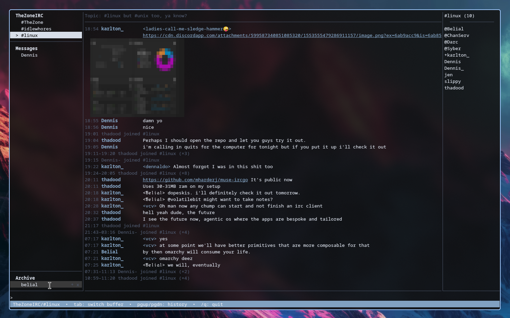

# muse-ircgo
Vibed to hell app, testing out MuseAI as a novice

A terminal IRC client in Go, built on [Bubble Tea](https://github.com/charmbracelet/bubbletea).
Split-view TUI, TLS connections, and first-class ZNC/bouncer support.



## Features

- Split-view TUI: buffer sidebar, chat pane, input, status bar
- Mouse: left-click a buffer in the sidebar to switch to it
- Channel nick list (ops first, then voiced, then alphabetical)
- CTCP queries answered automatically (`VERSION`, `PING`, `TIME`, …)
- ZNC/bouncer support with `server-time` backlog timestamps
- mIRC formatting rendered inline (colors, bold, italic, underline)
- Lossless event delivery: replay bursts apply backpressure instead of dropping messages
- Channel topic panel pinned above the chat feed (`/topic [new topic]`)
- Inline image previews: image URLs in chat render as half-block art
  (chafa-style), fetched in the background — works in any terminal
- Clickable links: URLs render underlined; click one to open it in your browser
- Channel logging: each channel/query buffer logs to one file under
  `<log_dir>/<server>/<channel>.log` (default `~/.local/ircgo/logs`); the
  last `history_playback` lines (default 50, set `history_playback = 0`
  to disable) replay into a buffer when it is first opened. Logging is
  optional: `logging = false` turns it off entirely, and `log_dir`
  points it at another directory (`~` and env vars are expanded)
- Query (DM) buffers are restored from their logs at startup, so they show
  in the sidebar without waiting for a new message
- Image previews regenerate when a buffer is reopened: art is never logged,
  so URLs in the replayed history are re-fetched automatically
- Sidebar ordering: the server window is its section's header row — click it
  to open the server buffer — then channels and query (DM) buffers indent
  beneath it, with a divider between the two groups
- Word wrap in the chat pane: long messages wrap with a hanging indent,
  ANSI-aware so colors survive the break; image art and long URLs are
  never split
- The focused buffer is remembered in the config (`last_buffer`, updated on
  every switch) and restored on the next launch
- Sidebar buffer management: hovering a buffer highlights its row and
  reveals a dim `x` that parks it under `-- Archive --` (channels stay
  joined, nothing is parted); archived rows also offer `+` to recover
  them to their grouping, while their `x` removes them from view
  entirely. The archive section is pinned
  to the bottom of the sidebar and only appears when something is parked,
  and new activity returns a parked or removed buffer to the sidebar on
  its own
- Drag-to-reorder: drag a sidebar buffer within its group — channels stay
  with channels, DMs stay under `-- Messages --`. Dragging a channel onto
  the `-- Archive --` divider parks it and auto-sends `PART` (recovering
  it re-sends `JOIN`); dragging a DM there just parks it. Your custom order
  is remembered in the config (`buffer_order`) and restored on the next
  launch
- TLS, with `insecure_skip_verify` for self-signed certs
- Auto-reconnect with backoff when the connection drops
- Nick collision fallback: a `433` at connect retries as `nick_`
- Kicks, mode changes, and channel invites are shown (op/voice changes
  update the nick list live)
- Buffers match case-insensitively: a reply from `Belial` lands in your
  existing `belial` query instead of opening a second buffer
- Unread markers: buffers with unseen activity show a bold yellow `*` in
  the sidebar, cleared when you switch to them
- Join/part/quit floods collapse: consecutive presence notices fold into
  one summary row per event, e.g. `17:02–20:05 thadood joined #idlewhores
  (×28)` (disable with `collapse_joins = false` under `[ui]`)

## Build

```sh
go build -o ircgo ./cmd/ircgo
```

## Run

```sh
mkdir -p ~/.config/ircgo
cp config.example.toml ~/.config/ircgo/config.toml
# edit it: nicks, servers, bouncer credentials
./ircgo
# or: ./ircgo -config /path/to/config.toml
```

Stuck at "connecting…"? Run with `-debug` and check the log — it records
each connection step (dial, TLS handshake, registration) with passwords
redacted:

```sh
./ircgo -debug
tail -f ~/.local/ircgo/debug.log
```

## Layout

```
cmd/ircgo            entrypoint: loads config, starts clients + TUI
internal/config      TOML config loading and validation
internal/irc         protocol layer
  message.go           IRCv3 parser (tags, prefix, params)
  ctcp.go              CTCP detection and parsing
  conn.go              TCP / TLS dial, line I/O
  client.go            registration, read loop, event pump
  caps.go              CAP LS/REQ/ACK negotiation
  sasl.go              SASL PLAIN
  debug.go             redacted connection diagnostics
internal/store       per-buffer scrollback (channels, queries, server windows)
internal/img         image URL detection, background fetch, half-block rendering
internal/ui          Bubble Tea models: sidebar, chat viewport, nick list,
                   input, status bar
  members.go         channel membership tracking (NAMES, JOIN/PART/QUIT/NICK)
internal/version     release version (`-version`, CTCP VERSION replies)
```

## Keys

- `tab` — cycle buffers (channels, queries, server windows)
- `alt+1` … `alt+9` — jump to a buffer by its sidebar position, top to bottom
- `enter` — send
- `pgup` / `pgdn` — scroll chat history (the pane stays put while you read;
  `end` or scrolling back to the bottom follows new lines again)
- mouse: left-click a buffer in the sidebar to switch to it; drag a buffer
  to reorder it within its group, or drag it onto `-- Archive --` to park
  it (channels auto-PART; drag back or click `+` to recover and re-JOIN);
  the mouse wheel scrolls the chat pane when it's over it

Quit with `/quit` (or `/q`) — `ctrl+c` no longer closes the app.

Slash commands: `/join #chan`, `/part [#chan]`, `/msg nick text`, `/me text`,
`/nick newnick`, `/topic [new topic]`, `/ctcp nick command [args]`,
`/reconnect`, `/quit` (or `/q`).

Dropped connections retry automatically with exponential backoff (2s, 4s,
8s… up to 5 minutes, with jitter), resetting after each healthy session.
The status bar shows `reconnecting…` while any server is down, and
`/reconnect` retries immediately instead of waiting out the delay.
Messages typed while disconnected aren't sent — the client warns you
instead of echoing them as if they went out.

CTCP is supported: `/me`-style actions render inline, incoming queries
(`VERSION`, `PING`, `TIME`, `FINGER`, `USERINFO`, `CLIENTINFO`) are answered
automatically via NOTICE, and CTCP exchanges stay in the active buffer.
`./ircgo -version` prints the release (currently v0.3.1).

A nick list appears on the right for channel buffers (ops first, then
alphabetical), built from NAMES replies and JOIN/PART/QUIT/NICK updates.
It hides on narrow terminals.

## ZNC notes

- Auth uses `PASS user/network:password`, assembled from the `username`,
  `network`, and `password` config fields. SASL PLAIN is available with
  `sasl = true`.
- The client requests `server-time` and `znc.in/server-time-iso` so backlog
  replays render with their original timestamps.
- Messages from `*status` land in the server window.

## Roadmap

- SASL EXTERNAL (client certs)
- Configurable keybinds and themes
